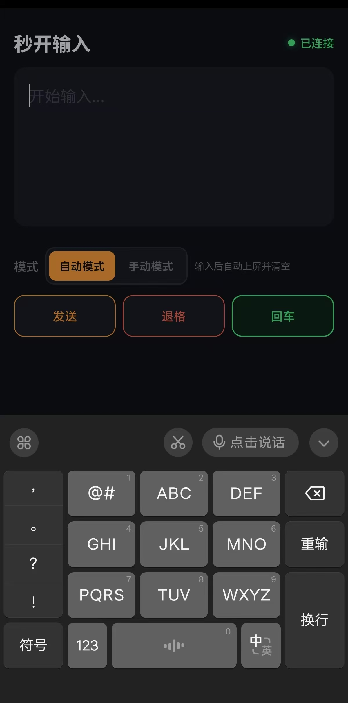

# 秒开输入（mkinput）

这是一个神奇的软件！电脑启动一个局域网ip+端口，手机输入此地址连接到电脑，手机打字、语音输入都会自动传输到电脑。让你的手机秒变高效输入工具。

## 产品理念

你有没有发现，手机打字和语音输入其实比电脑更好用？

手机麦克风收音更清晰，输入法的语音识别也更准确，而电脑端的语音输入经常会遇到识别不准、环境干扰、操作不方便等问题。

所以有了这个项目：让手机来负责输入，电脑负责接收。通过 WebSocket 实时传输，把手机上的文字和语音输入轻松送到电脑上。

## 核心原理

电脑运行软件后，会启动一个简单的 Web 服务（例如 `192.168.1.60:9999`）。

手机浏览器打开这个地址，就可以使用websocket长连接到电脑。无论是手机键盘输入，还是语音转文字，输入内容都会实时发送到电脑后端

电脑后端调用 sendinput 函数，将输入内容发送到电脑当前焦点窗口。

整个过程无需安装手机 App，只需要一个浏览器即可完成连接。

## 使用方法

1. **打开程序**

   双击 `mkinput.exe`，程序会自动隐藏到右下角**系统托盘**。
2. **获取地址**

   右键托盘图标 → **服务地址** → 点击 IP 地址复制。
3. **手机连接**

   确保手机和电脑处于同一 WiFi 网络，打开手机浏览器访问复制的网址。
4. **开始输入**

   在手机页面中输入文字或使用语音输入，内容会实时出现在电脑当前输入位置。

## 功能介绍

- **自动输入**

  手机输入或语音识别后的内容，会自动同步到电脑，无需额外操作。
- **手动发送**

  输入完成后点击发送按钮，再将内容发送到电脑，适合需要确认后输入的场景。
- **智能清屏**

  每次发送完成后，手机输入框自动清空，方便连续输入。
- **退格支持**

  点击退格按钮，可以删除电脑光标前的一个字符，并同步删除手机输入框中的最后一个字符。
- **回车输入**

  支持发送回车键，可用于聊天、搜索、命令行等场景。
- **简单可靠**

  除了用户主动点击退格，不会自动修改电脑端已有内容，不会发生误删或内容替换。

## 页面截图



## 项目结构

```
mkinput/
├── main.go # 主程序：Web服务、WebSocket、输入处理、系统托盘
├── web/
│ └── index.html # 手机端页面（嵌入程序）
├── internal/
│ └── keyboard/
│ └── sendinput.go # Windows SendInput 封装
├── assets/
│ ├── architecture.svg # 架构图
│ ├── icon.ico # 托盘图标
│ └── UI.jpg # 手机端截图
├── png2ico.py # 图标转换工具
├── go.mod # Go 模块配置
├── go.sum # 依赖校验文件
└── README.md
```

## 开发与发布

### 本地运行

```bash
go run .
热更新开发
go install github.com/air-verse/air@latest

air
编译发布
go build -ldflags -H=windowsgui -o build/mkinput.exe .
发布版本
git push origin v1.2.0

gh release create v1.2.0 build/mkinput.exe -t "v1.2.0"

```

## 技术栈

- **后端服务**
  - Go net/http + gorilla/websocket
- **系统托盘**
  - getlantern/systray
- **键盘模拟**
  - Windows user32.dll!SendInput
  - 直接 syscall 调用，无 cgo 依赖。

* **前端页面**
  - 原生 HTML + CSS + JavaScript
  - 页面直接嵌入 Go 二进制文件。

## 程序特点

**程序特点**

- 单文件运行
- 无需安装
- 无需账号登录
- 局域网直连
- 打开即可使用

## 系统要求

- Windows 10 / Windows 11 x64
  手机和电脑处于同一局域网
  Go 1.23+（仅开发编译需要）
  为什么叫「秒开输入」
- 不用安装客户端，不用注册账号，不用配置复杂服务。
- 打开电脑端程序，手机访问地址，几秒钟即可开始输入。
- 简单，就是最快的连接方式。

## License

MIT
